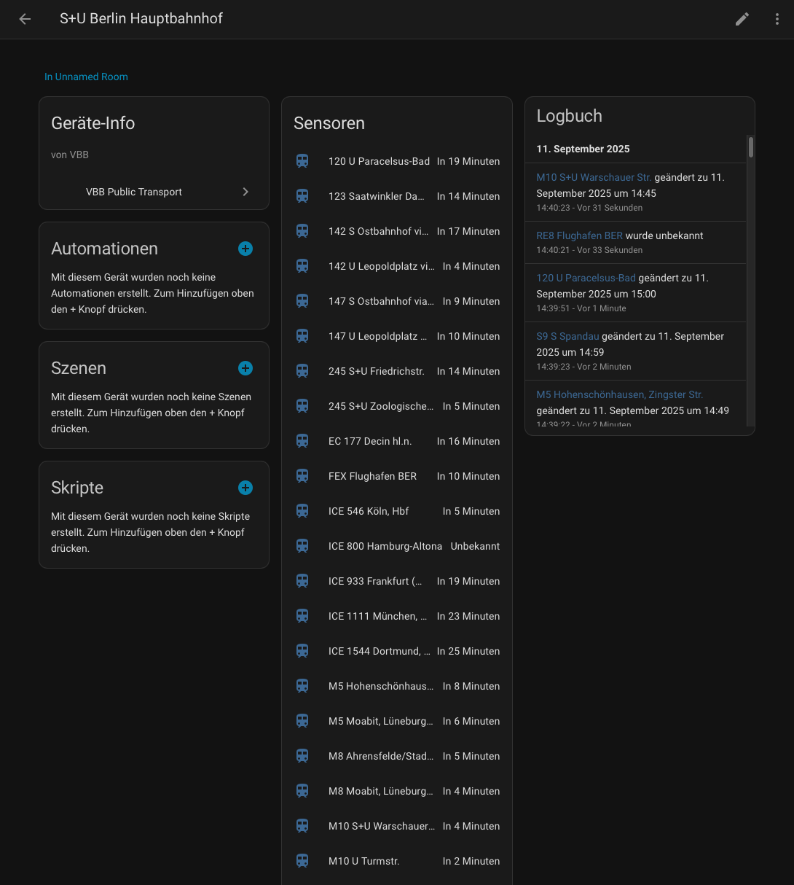

# ha-public-transport-vbb

This repository provides a Home Assistant integration that fetches departure times from the Berlin–Brandenburg public transport network (VBB) and exposes them as sensors. Each configured stop appears in Home Assistant as its own device.

## Example

## Installation

The integration is available as a [default repository in HACS](https://hacs.xyz/):

1. Open **HACS → Integrations** and search for **VBB Public Transport**.
2. Install the integration and restart Home Assistant afterwards.

Alternatively, copy the `custom_components/vbb` folder into your `custom_components` directory.

## Configuration

After installation the integration can be configured via the user interface:

1. Go to **Settings → Devices & Services → Add Integration**.
2. Choose **VBB Public Transport**.
3. Search for a stop by entering its name or coordinates and select the desired result.
4. Set the name, query window (`duration` in minutes) and the maximum number of results (`results`).

### Stop ID (optional)

The integration includes a search function so a manual stop ID is no longer required. It can still be retrieved from the public API: `https://v5.vbb.transport.rest/locations?query=<stop name>` (e.g. `https://v5.vbb.transport.rest/locations?query=Berlin%20Hauptbahnhof`). The stop ID is located in the `id` field of the JSON response.

For each line and direction at the stop a separate sensor is created (e.g. `S7 S Strausberg`). The sensor's state shows the next departure time. The current delay in minutes is exposed as the `delay` attribute. Further departures are available in the `departures` attribute. Additional information such as `latitude`, `longitude`, `station_dhid`, `line_id`, `operator` and `trip_id` is provided.

## Notes

The integration uses the public API at `https://v5.vbb.transport.rest/`. An active internet connection is required. Service coverage is limited to stops located in Germany (VBB service area). Home Assistant 2023.12 or newer is required.

By default departures for 120 minutes ahead and up to 100 results are queried. These values can be adjusted in the configuration.

## Author

This repository was created by [404GamerNotFound](https://github.com/404GamerNotFound) (Tony Brüser).
